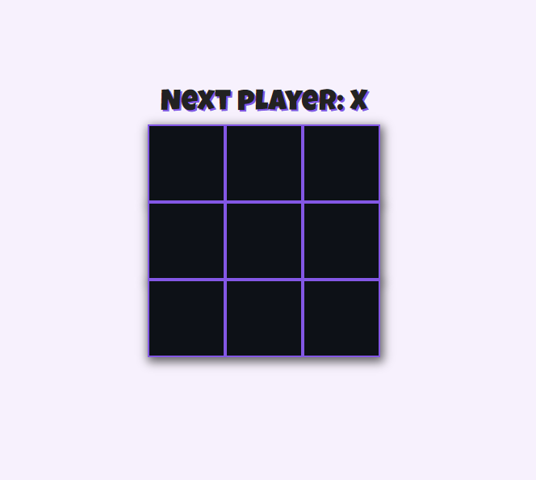

<h1 align="center">
    
</h1>

<h1 align="center">
    <a href="https://hash.vercel.app/">Jogo da velha 🧓🏻</a>
</h1>

<h4 align="center">

· [Reportar bug](#-contribuindo)
    
</h4>

<h2> 📘 Índice </h2> 

- [👨‍🏫 Sobre](#-sobre)
- [🚀 Tecnologias](#-tecnologias)
  - [🔧 Deploy](#-deploy)
- [☕ Pré-requisitos](#-pré-requisitos)
- [🔧 Instalando](#-instalando)
- [💿 Usando](#-usando)
- [📮 Contribuindo](#-contribuindo)
- [🤟 Colaboradores](#-colaboradores)
  - [😎 Seja um colaborador](#-seja-um-colaborador)
- [📜 Licença](#-licença)

## 👨‍🏫 Sobre 

Estou estudando React e este é meu primeiro projeto, foi feito a partir do [tutorial oficial](https://pt-br.reactjs.org/tutorial/tutorial.html) no site do React.


## 🚀 Tecnologias 

- [x] React

### 🔧 Deploy

- Efetuado na [Vercel](https://vercel.com)

## ☕ Pré-requisitos 

Antes de por a mão na massa, verifique se você atende aos seguintes requisitos: 

- [ ] Ter uma versão recente do Node instalada  
- [ ] Ter uma versão recente do Yarn instalada

## 🔧 Instalando 

Para instalar, siga os passos:

```bash
## Instalando dependências 

yarn install 

## ou

npm install
```

## 💿 Usando 

Para usar, siga os passos: 

```bash
## Rodando projeto  

yarn start 

## ou

npm start
```

## 📮 Contribuindo 

Se esta é sua primeira contribuição, [veja o seguinte tutorial.](https://github.com/firstcontributions/first-contributions/blob/master/translations/README.pt_br.md)

## 🤟 Colaboradores 

Agradecemos aos seguintes desenvolvedores que contribuíram:

<table>
  <tr>
    <td align="center">
      <a href="#">
         <br>
        <sub>
          <b>Leonardo Campello</b>
        </sub>
      </a>
    </td>
  </tr>
</table>

### 😎 Seja um colaborador  

Gostaria de fazer parte deste projeto? Clique [AQUI](#-contribuindo) e leia as intruções para contribuir.

## 📜 Licença

Realizado em 2020. Esse projeto está sob a [licença MIT](./LICENSE).

<h2> Feito com 💚 por Leonardo Campello </h2>